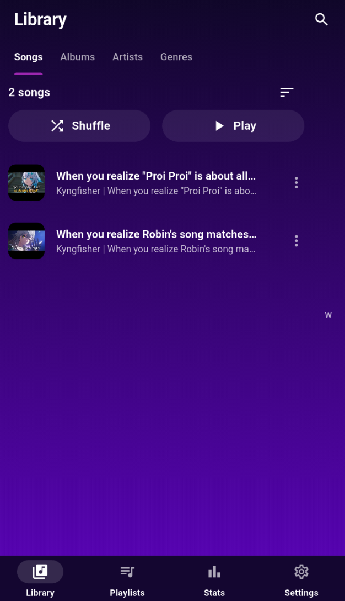
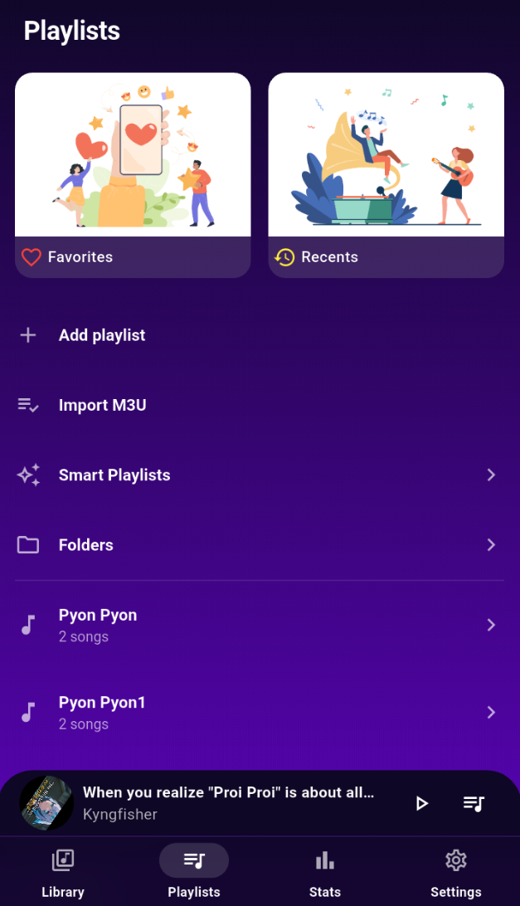
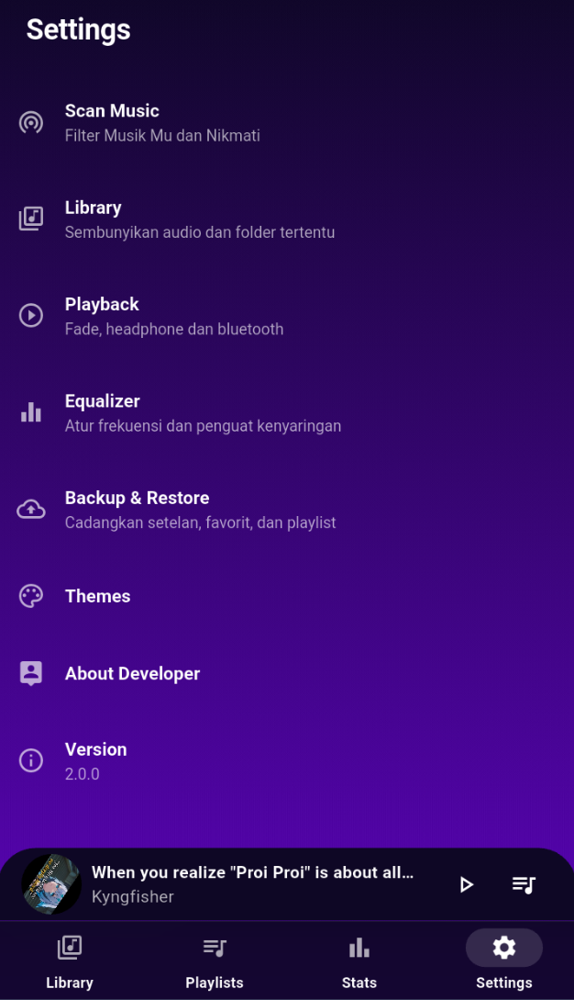
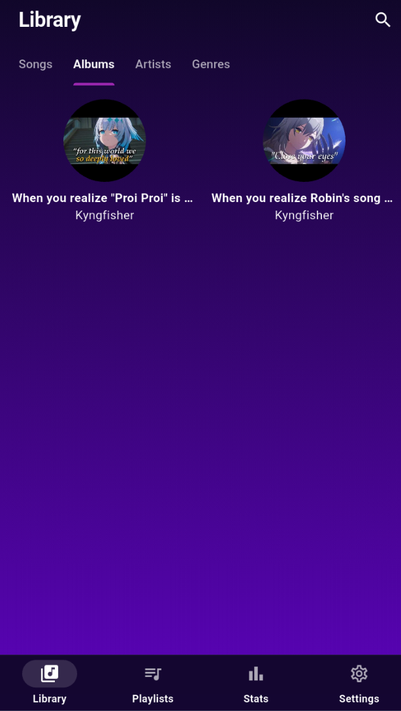
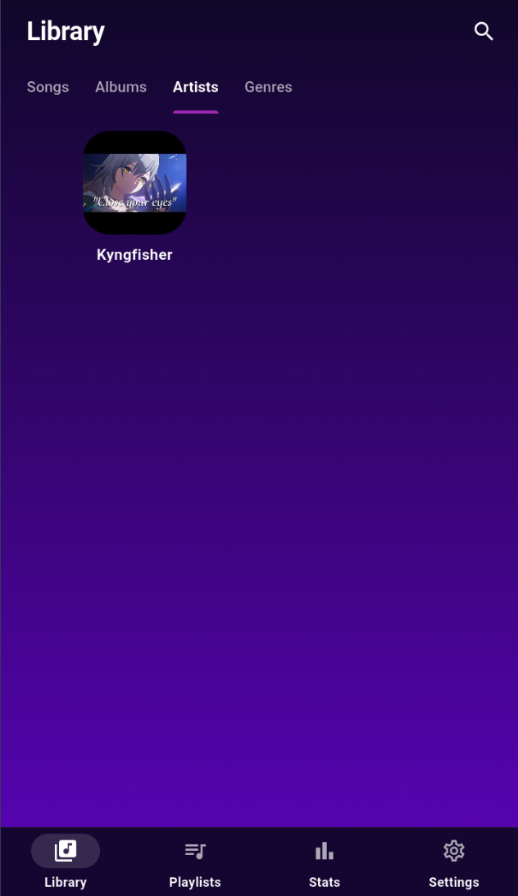
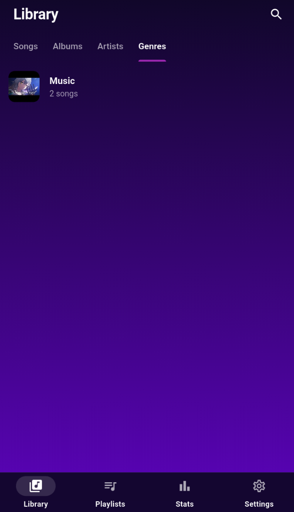
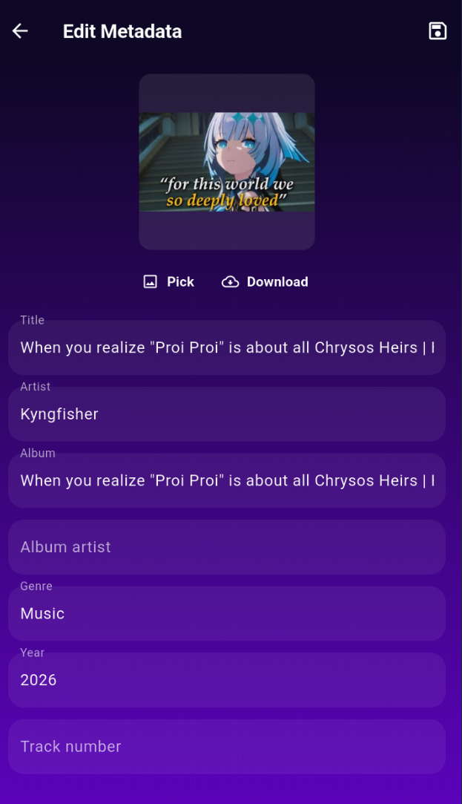

# 🎵 Music Player

A modern local music player built with **Flutter** that allows you to play and manage music stored on your Android device.

## ✨ Features

See the complete feature list in [FEATURE.md](FEATURE.md).

## 📱 Platform

- Android

## 📸 Preview

| Home | Player | Playlist | Settings |
|------|---------|----------|----------|
|  |  |  |  |

| Albums | Artists | Genres | Metadata |
|---------|----------|--------|----------|
|  |  |  |  |

---

## 🚀 Getting Started

### Prerequisites

Before running the project, make sure you have:

- Flutter **3.41.5**
- Android Studio or Visual Studio Code
- Android Emulator (Android 11 recommended) or a physical Android device

### Installation

1. Clone this repository

```bash
git clone https://github.com/JonathanZefanya/Aplikasi-Music-Player.git
```

2. Navigate to the project

```bash
cd Aplikasi-Music-Player
```

3. Install dependencies

```bash
flutter pub get
```

4. Run the application

```bash
flutter run
```

---

## 🔐 Android Permissions

The application requires the following permissions:

```xml
<!-- url_launcher -->
<queries>
    <intent>
        <action android:name="android.intent.action.VIEW" />
        <data android:scheme="https" />
    </intent>
</queries>

<!-- Required for deleting/updating songs & playlists -->
<uses-permission android:name="android.permission.MANAGE_EXTERNAL_STORAGE" />

<!-- Android 10 and below -->
<uses-permission
    android:name="android.permission.WRITE_EXTERNAL_STORAGE"
    android:maxSdkVersion="29" />
<uses-permission android:name="android.permission.READ_EXTERNAL_STORAGE" />

<!-- Android 13+ -->
<uses-permission android:name="android.permission.READ_MEDIA_AUDIO" />

<!-- Background audio playback -->
<uses-permission android:name="android.permission.WAKE_LOCK" />
<uses-permission android:name="android.permission.FOREGROUND_SERVICE" />
```

---

## 🛠 Built With

- Flutter       //Framework
- Hive          //Local Database
- flutter_bloc  //State Management

## 📄 License

ComingSoon - Feel Free To Use